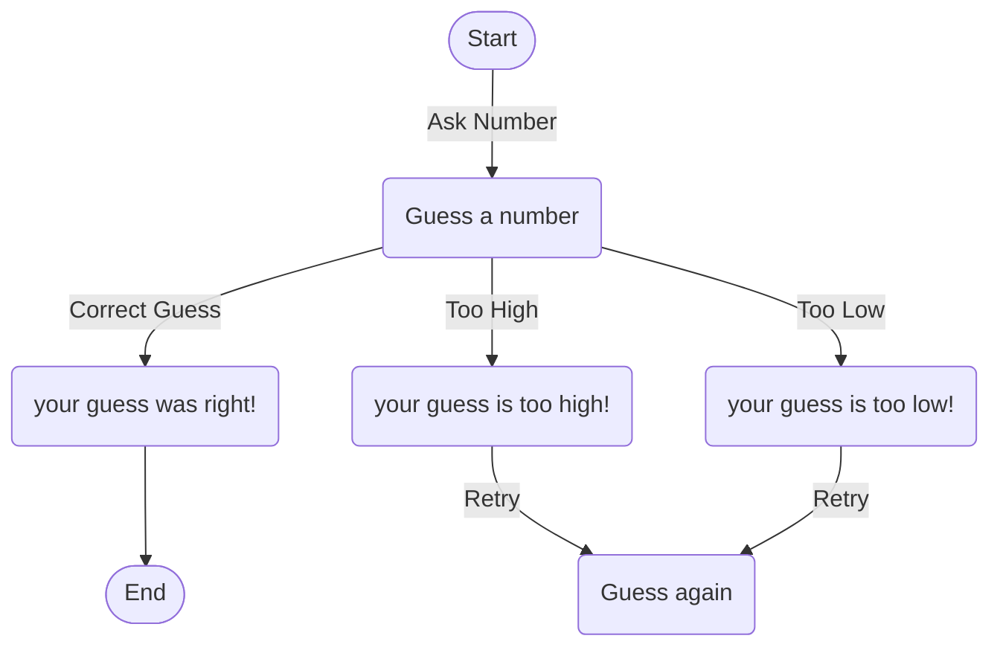

### Explanation Of The Guessing Game:
    1. **Start** : this is where the game starts.
    2. **Ask Number**: Player guesses a number.
    3. If the guess is correct, they continue to **Correct Guess**
    4. If the guess is too high or too low, the game will display said response.
    5. The game will then give you a **Retry** until the correct number is guessed. 
    6. Finally, when the correct number is given the game will give you the **End** response. 
